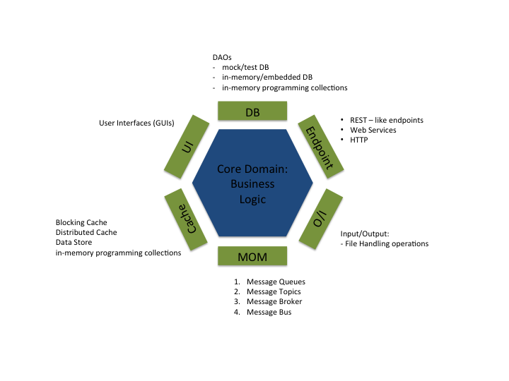
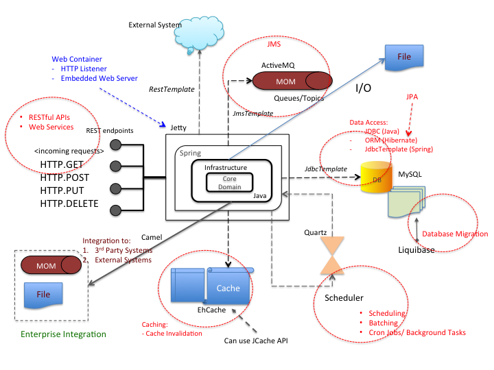
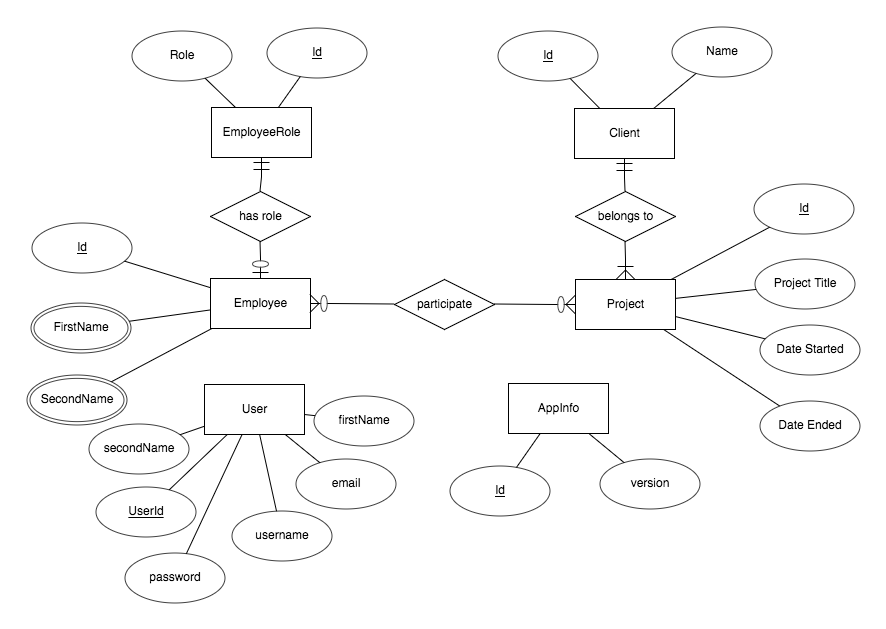
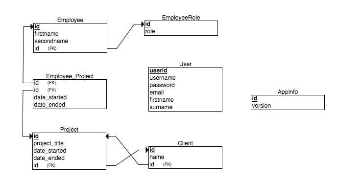

# Enterprise Application : Snowman

[](https://travis-ci.org/colinbut/enterprise-application)

## Table of Contents

- [Preamble](#preamble)
- [Pre-requisites](#prerequisites)
- [Software Architecture](#architecture)
- [Database Design](#db-design)
- [Data Access](#data-access)
    - [Java - JDBC](#jdbc)
    - [Spring - JdbcTemplate](#jdbctemplate)
    - [Object Relational Mapping](#orm)
- [Messaging](#messaging)
- [Caching](#caching)
- [Uber Jar](#uber-jar)
- [Embedded Jetty](#embedded-jetty)
- [Database Migration](#database-migration)
- [Scalability](#scalability)
- [Clustering](#clustering)
- [Resiliency](#resiliency)

This project aims to provide a skeleton example of a common traditional (perhaps now viewed as legacy) enterprise
like application. 

This project's concepts are an extension of another demo project Sales-Order-System where it showcase more advanced common features that 
is normally seen in a traditional big-scale enterprise application.

_Note, this project is not a complete application and i have no intention of making it complete, it only serves the purpose of providing a variety of specific
demonstrations only._

### <a name="preamble"></a>Preamble

Snowman is an fictional enterprise scale/ready employee management system (EMS). This project uses Snowman to 
demonstrate the characteristics of a stereotypical backend enterprise application.
  
  
  
Snowman exposes its functionality via REST (-like) endpoints. Essentially this is a 
backend web service.

### <a name="prerequisites"></a>Pre - Requisites

- Java JDK 7
- Maven
- MySQL
 
 
1. Start up MySQL Server 
2. run.sh

### <a name="architecture"></a>Software Architecture

Instead of using a Layered Architecture where you commonly have 3 layers with one directional flow, this project showcase
a Hexagonal Architecture (Ports and Adapters). The core domain comprises of the main business logic would be the inner and
the application infrastructure (Database, Message Queues, REST endpoints) would be the outer layers. 

  

This is how the system components fit together:



### <a name="db-design"></a>Database Design



Database table structure:



### <a name="data-access"></a>Data Access

Rather than having a logical Data Access Layer within a 3 layered architecture, in a hexagonal architecture data access are
in an outer layer. 

#### <a name="jdbc"></a>Java - JDBC

One way of accessing the db from the application is using raw JDBC. This is quite low level. See ApplicationInfoDaoImpl.java

#### <a name="spring-jdbctemplate"></a>Spring - JDBC

The application framework in Spring provides a level of abstraction of data access by giving the usage of JdbcTemplate. This
class from Spring implements the GoF Template design pattern. By using this class, it relieves away a lot of the 'pain' of writing 
so called 'boilerplate' code in setting up db connections, exception handling etc. See UserDaoImpl.java

#### <a name="orm"></a>Object-Relational-Mapping(ORM)

Object Relational Mapping (ORM) is the mapping of relational database tables to objects and vice-versa. 
We use JPA standard along the the Hibernate implementation to achieve this. Model objects (Entities) are part of thus 'anemic'
data model. The DAOs encapsulates Hibernate EntityManager to do the basic CRUD operations.

### <a name="messaging"></a>Messaging

Communication to 3rd party external systems is primarily achieved via messaging using JMS & ActiveMQ as the 
implementing underlying Messaging System (Message Brokers, Message Queues, Topics).
 
Apache ActiveMQ is JMS compliant belonging to open source apache foundation. One of the commonly used MQ out there. 

### <a name="caching"></a>Caching

[TBD]

### <a name="uber-jar"></a>Uber Jar

As part of the deployment process, Application is packaged up in a "uber" runnable executable jar.
This jar contains all dependencies copied in. And can be easily run from a command line with:

```java
java -jar target/Snowman.jar
```

This whole process is achieved by the [Maven Shade Plugin](https://maven.apache.org/plugins/maven-shade-plugin/)

### <a name="embedded-jetty"></a>Embedded Jetty

Rather than deploying the application in either a full blown JavaEE application server (JBoss/Wildfly, Websphere, Weblogic, Geronimo etc)
or a Web/JSP Container (Tomcat, Jetty, UnderTow), we embed a HTTP listener into the application in the form of
"Embedded Jetty". 

All dependencies are bundled/packaged together in an Uber jar file so it works. This means it is therefore
wasn't necessary required to be provided with specific JavaEE dependencies from the JavaEE platform.

### <a name="database-migration"></a>Database Migration

Database updates are implemented using patches via changesets with a database migration tool in [liquibase](http://www.liquibase.org/)
to execute them in order to 'patch' up the database.

To run, execute the maven liquibase plugin by...

Running update patches:

```xml
mvn liquibase:update
```

And to rollback those particular patches:

```xml
mvn liquibase:rollback -Dliquibase.rollbackCount=1
```

### <a name="scalability"></a>Scalability

1. Horizonantal Scalability
2. Vertical Scalability

#### Horizontal Scalability a.k.a "Scaling Out"

To support horizontal scalability you run multiple instances of the same application.

You can do this manually like:

```java
java -jar -Dport=[port number] target/Snowman.jar
```

where port number is an unused port

#### Veritcal Scalability a.k.a "Scaling Up"

This option is limited kind of a way. You can opt to run this application in a higher spec 
machine. Alternatively, you can give more memory to the JVM by tuning the min and max 
parameters like the following:

```java
java -jar -Xms256m -Xmx2048m target/Snowman.jar
```

### <a name="clustering"></a>Clustering

No clustering options. This application does not run in a managed cluster. Horizontal scalability
was chosen as demonstration in favour of running Cluster Servers to achieve Clustering.

See [Scalability](#scalability) for more info.

### <a name="resiliency"></a>Resiliency / Fault Tolerance

1. Failover and Recovery
2. Disaster and Recovery

#### Failover and Recovery

No F&R is supported. 

You can failover the application easily (assuming you are running 
multiple instances to mimic multiple nodes servers). Just do a:

```bash
kill -9 [pid]
```

where pid is the process id of the particular application node server.

But there is no Recovery. Because no Clustering options. Refer to [Clustering](#clustering) section.

#### Disaster and Recovery

Although not specifically supported here, you can achieve this also. Manual intervention is required 
though in order to start up the application (or group of applications) together. 

To do Disaster Recovery a.k.a DR, you need to have the concept of a "Site". Commonly, use 
multiple sites. For simplicity, assume 2 sites - 1 Primary Site and the other is Standby Site.
Both sites would house the set of applications but only one site is up.

If Primary site considered fail (i.e. multiple failovers of one or more applications (or application components
if it is a Distributed Component Architecture)), then the Primary site should shutdown and thus Standby site
would be required to be started up. 
